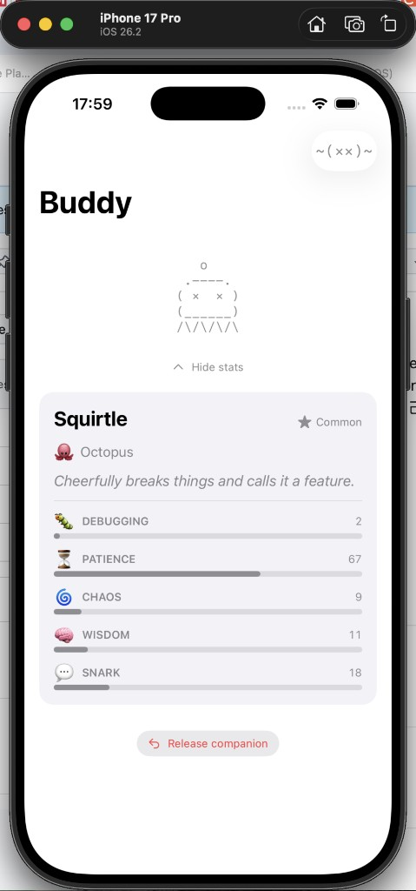
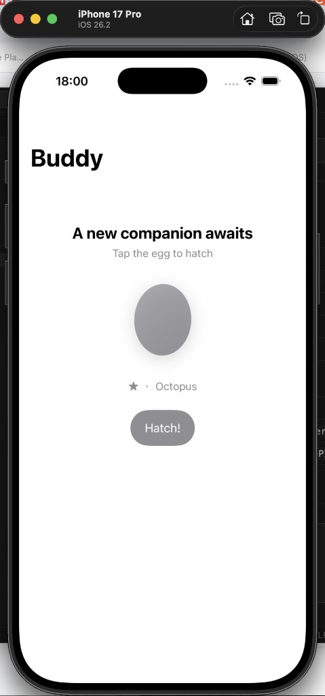

# BuddyCompanion

iOS implementation of the Buddy companion system, ported from Claude Code's source.

## Screenshots

| Companion | Hatch |
|:---------:|:-----:|
|  |  |

## Project Structure

```
BuddyCompanion/
├── BuddyCompanionApp.swift     # App entry point
├── ContentView.swift           # Root view
├── Models/
│   ├── CompanionTypes.swift    # Rarity, Species, Eye, Hat, Stats, Bones, Soul, Companion
│   ├── CompanionLogic.swift    # Mulberry32 PRNG + FNV-1a hash + roll algorithm
│   └── CompanionStorage.swift  # UserDefaults persistence (ObservableObject)
├── Data/
│   └── Sprites.swift           # All 18 species × 3 frames of ASCII art + renderSprite()
├── Services/
│   └── SoulGenerator.swift     # Anthropic Claude API call for name + personality
└── Views/
    ├── CompanionSpriteView.swift # Animated ASCII sprite with idle sequence + pet hearts
    ├── SpeechBubbleView.swift    # Timed speech bubble that fades after ~10s
    ├── StatsView.swift           # Animated stat bars (DEBUGGING/PATIENCE/CHAOS/WISDOM/SNARK)
    ├── HatchView.swift           # First-run hatch flow with egg animation
    ├── CompanionCardView.swift   # Full card: sprite + bubble + stats
    └── ContentView.swift         # NavigationStack root
```

## Setup in Xcode

1. Open Xcode → **File → New → Project** → **App**
   - Product Name: `BuddyCompanion`
   - Interface: SwiftUI
   - Language: Swift
   - Minimum Deployment: iOS 16+

2. Delete the auto-generated `ContentView.swift` and `Assets.xcassets` stubs.

3. Drag all the files from this folder into the Xcode project navigator, keeping the group structure.

4. In `Info.plist`, add a string key:
   ```
   ANTHROPIC_API_KEY = sk-ant-...your key here...
   ```

5. Build & run on simulator or device.

## How it works

### Deterministic companion generation
Every user gets the same companion every time — no randomness at runtime.
`rollCompanion(userId:)` runs **Mulberry32 PRNG** seeded by **FNV-1a hash** of `userId + "friend-2026-401"`.
This is a direct port of `companion.ts` from the original TypeScript source.

### Bones vs Soul
- **Bones** (species, rarity, eye, hat, shiny, stats): computed from hash, never stored.
  Changing the species list doesn't break existing companions.
- **Soul** (name, personality, hatchedAt): generated once via Claude API, stored in UserDefaults.

### ASCII sprites
18 species × 3 animation frames. The idle sequence `[0,0,0,0,1,0,0,0,-1,0,0,2,0,0,0]` runs
at 500ms ticks. `-1` triggers a blink by overriding the eye to `×`.

### Rarity
| Rarity    | Weight | Stat floor |
|-----------|--------|-----------|
| Common    | 60%    | 5         |
| Uncommon  | 25%    | 15        |
| Rare      | 10%    | 25        |
| Epic      | 4%     | 35        |
| Legendary | 1%     | 50        |
| Shiny     | 1%     | any       |
